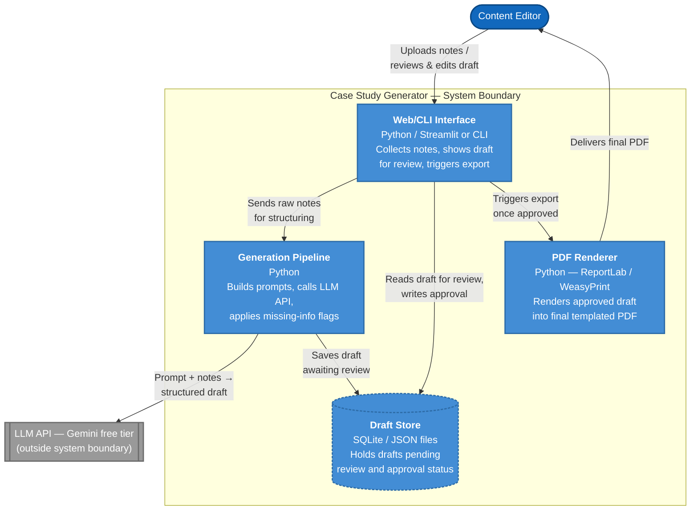

# Container Diagram (C4 Level 2)

Shows the main applications and data stores inside the system, their responsibilities, and how they communicate. External APIs are shown outside the system boundary.

**Legend:** Light blue = containers inside our system. Dashed border = a data store. Gray = external API, outside our system boundary.
