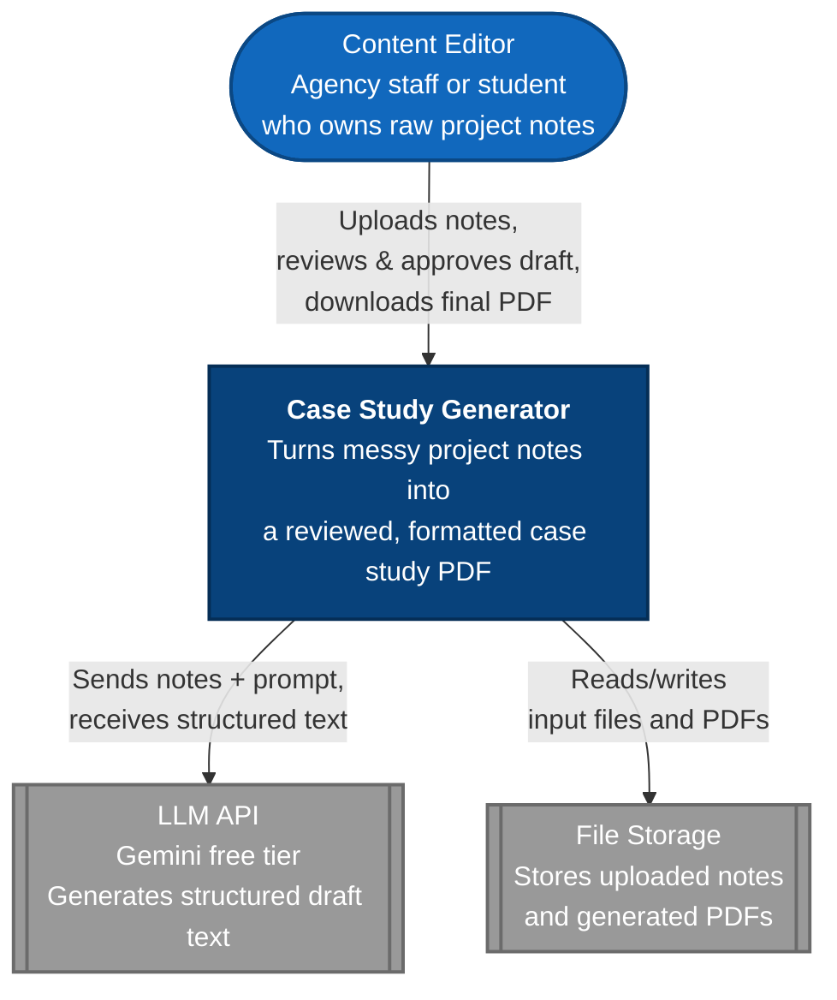

# System Context Diagram (C4 Level 1)

Shows the system as a single box, its users, and the external systems it connects to.

**Legend:** Blue = the system we're building. Gray = external systems outside our control. 
